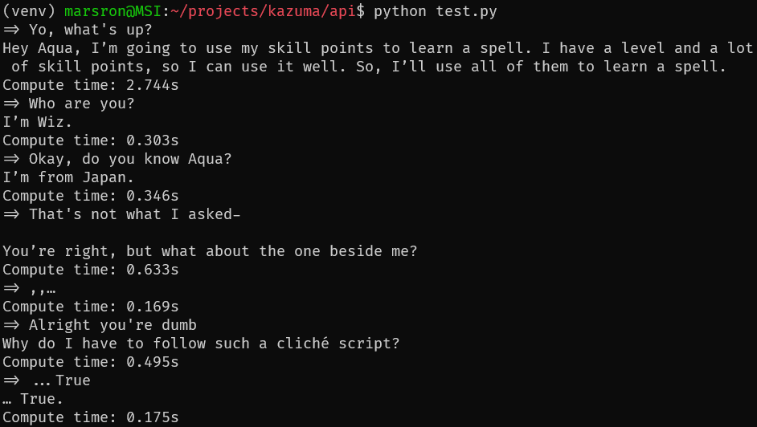

# Kazuma

A [DialoGPT](https://github.com/microsoft/DialoGPT) AI chatbot model trained on KonoSuba Light Novel conversations.

I've written a blog on this project. Check it out here: https://marsron.ml/blog/ai-chatbot-kazuma

Training data is webscraped from [cgtranslations.me](https://cgtranslations.me/konosuba) using Node.js.

Model is trained on [Google Colab](https://colab.research.google.com).

The API server runs on [FastAPI](https://fastapi.tiangolo.com) and [Uvicorn](https://uvicorn.org).

## Example

Kazuma is pretty dumb so don't expect GPT-3 level responses lol



## Usage

Feel free to ~~steal~~ take inspiration from this project in any way you want, it's under MIT license so you can do whatever you want ;)

> Note: This project is not fully documented, please use this at your own risk.

> Another note: I am not proficient with Python, so if you see JavaScript code that's the reason why :p

Clone the project

```bash
$ git clone https://github.com/MarsRon/kazuma
```

Go to the API directory

```bash
$ cd kazuma/api
```

Create a Python virtual environment

```bash
$ python3 -m venv venv
$ source venv/bin/activate
```

Install dependencies

```bash
$ pip install -r requirements.txt
```

Run the test script and have a few conversations with Kazuma

```bash
$ python test.py
```

Start the API server

```bash
$ python main.py
```

## Do everything from scratch

1. Get training data, see `data/README.md`
2. Train the model on Google Colab, see `train/train-kazuma.ipynb`
3. Download the model to `model/`
4. Continue with [Usage](#usage) step 2
